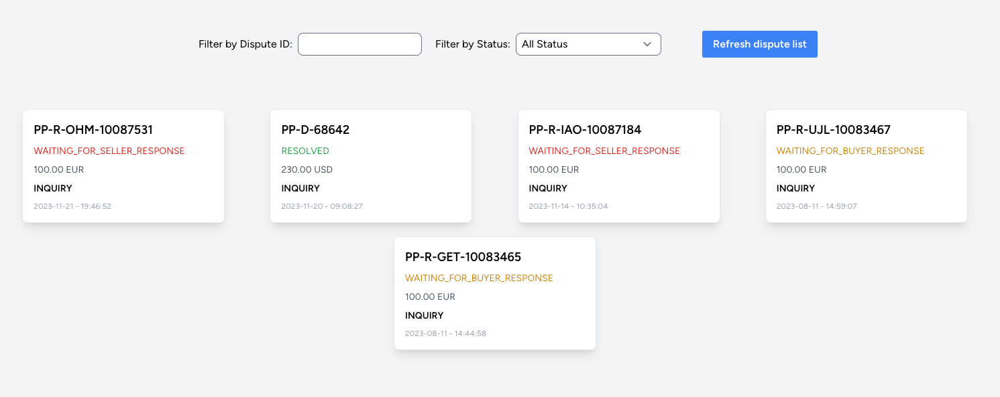
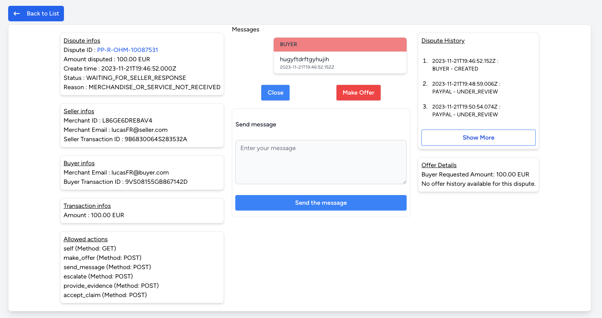

# PayPal Dispute Management

Manage and view PayPal disputes with ease using this React application.

## Table of Contents

- [Introduction](#introduction)
- [Features](#features)
- [Installation](#installation)
- [Usage](#usage)
- [Configuration](#configuration)

## Introduction

This project is a React application designed to interact with the [PayPal API](https://developer.paypal.com/docs/api/customer-disputes/v1/) to manage and view customer disputes. It provides a user-friendly interface to browse through disputes, view details, and take necessary actions.


## Features

- View a list of disputes
- View detailed information about a specific dispute
- Filter disputes based on ID and status
- Load more disputes for better navigation
- Refresh disputes to fetch the latest data

## Installation

To run this application locally, follow these steps:

1. Clone the repository:

   ```bash
   git clone https://github.com/your-username/paypal-dispute-management.git
   ```

2. Navigate to the project directory:

   ```bash
    cd paypal-dispute-management
   ```

3. Install dependencies:

   ```bash
   npm install
   ```

## Usage

1. Start the development server:

   ```bash
   npm start 
   ```

2. Open your browser and go to http://localhost:3000 to access the application.


## Configuration

Before running the application, make sure to set up your PayPal API credentials in the .env file. Rename the .env.example file to .env and fill in your PayPal client ID and client secret.

   ```bash
    REACT_APP_PAYPAL_CLIENT_ID=your-client-id
    REACT_APP_PAYPAL_CLIENT_SECRET=your-client-secret
   ```

## Screenshots

- Dispute Panel


<br />

- Dispute Details

